# ʕ•́ᴥ•̀ʔっ OrangeMC - A guide for idiots

### Please read through these instructions line by line, WORD BY FUCKING WORD or i will do unspeakable things to you...

#### List of dependencies (what you need to install or use) : 

 * Use OPTIFINE or the models won't load.

 * Make sure you have installed the PACKS correctly.

 * Check if you have installed ALL THE PACKS by counting the total listed in the packs section!!

#### How to install the Resource Packs : 

 * Download the zip file : [CLICK ME!!!](https://github.com/Govindmenon69/OrangeMC/archive/refs/heads/main.zip)

 * after downloading FIND YOUR DOWNLOADED FILE and extract its content : 

   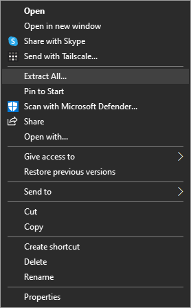

 * OPEN the EXTRACTED folder and open 'OrangeMC-main' folder which is inside the EXTRACTED folder.
   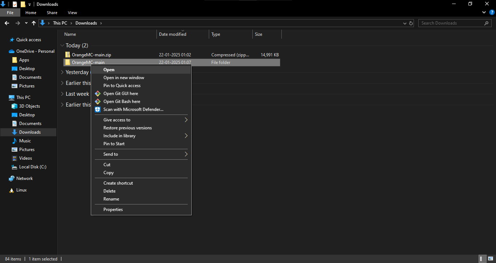

   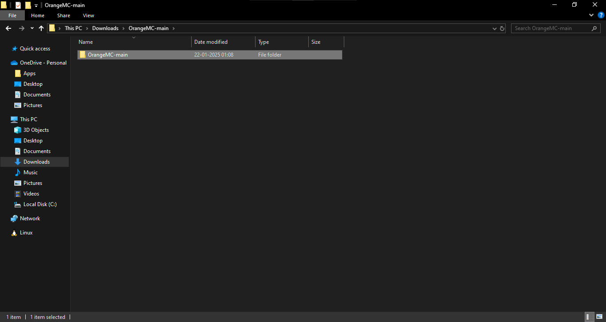

   note that the 'OrangeMC-main'folder is inside the EXTRACTED FOLDER WHICH IS TITLED THE SAME.

 * Delete the file titled '.gitignore'

   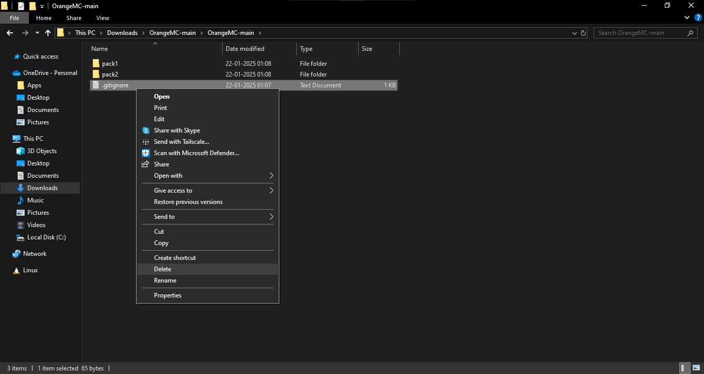

 * Copy all the REMAINING folders inside the OrangeMC-main folder, the one where you just deleted .gitignore (should be named pack1 , pack2 , etc.)

   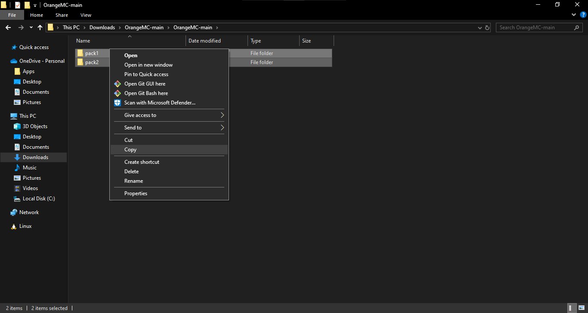

 * Locate your Resource-Pack folder for minecraft through this method : 

   * Open and start Minecraft!
    
   * Click on the 'Options...' in the Main Menu

      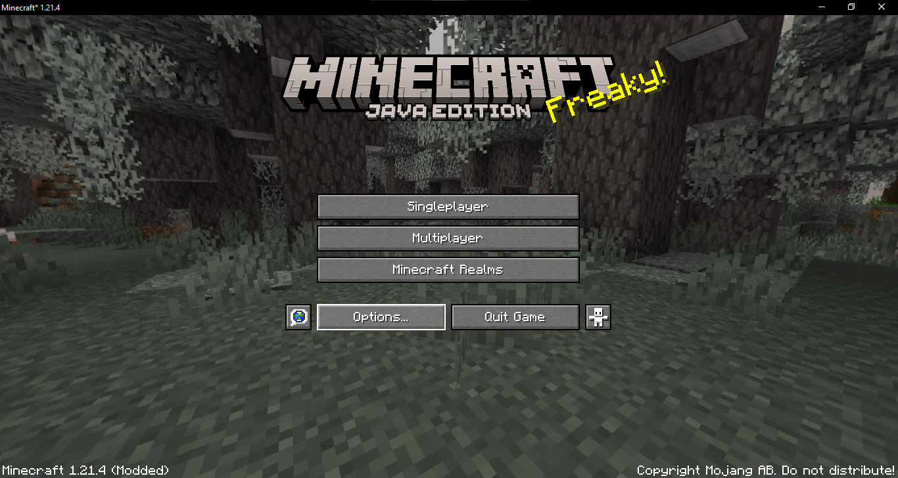

   * Click on 'Resource Packs...'

      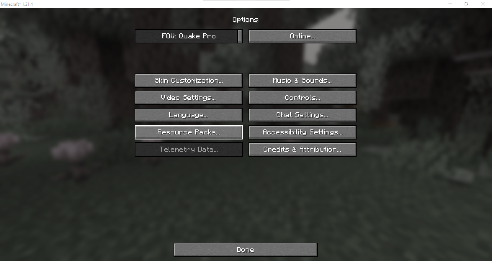
   
   * Click on the 'Open Pack Folder' button
     
      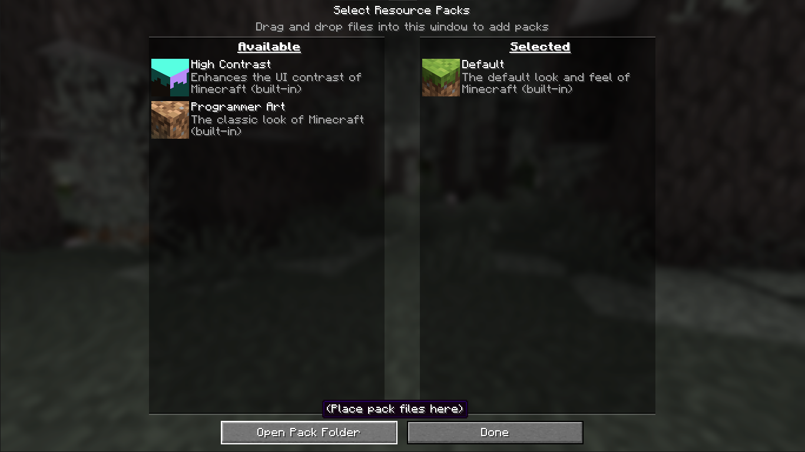
      
   * This will OPEN FILE MANAGER where you should PASTE the copied folders!

      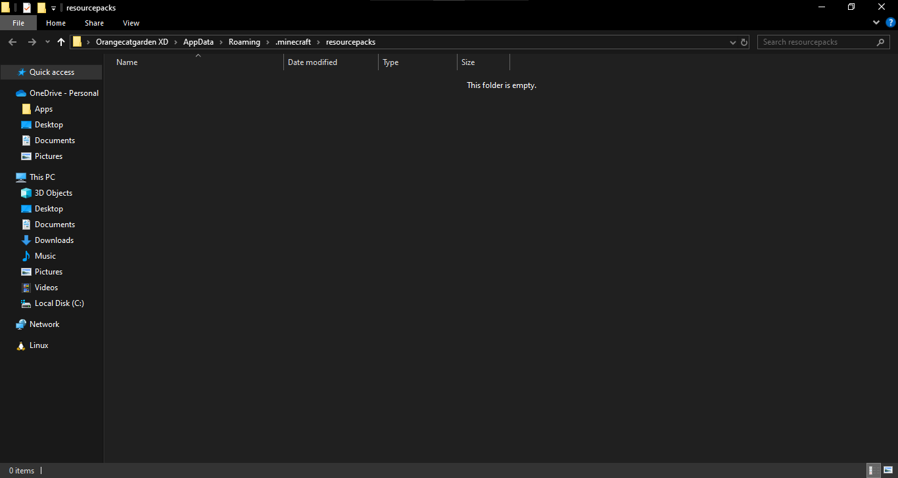

        The file manager

      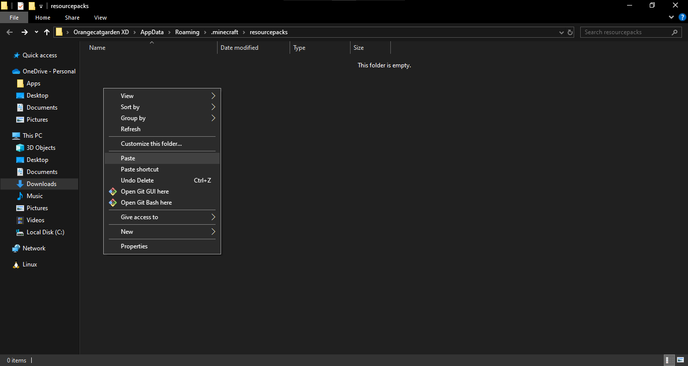

        Paste the copied files here

      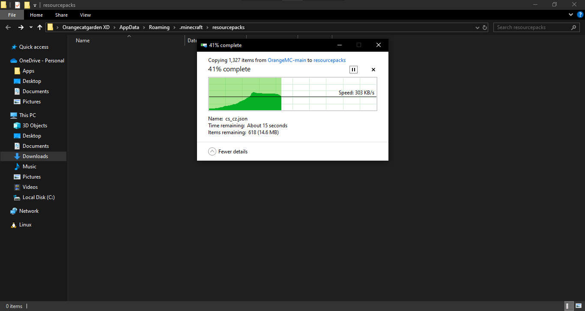

        Pasting...

   * AFTER Pasting the files go back to MINECRAFT'S Resource Packs menu

     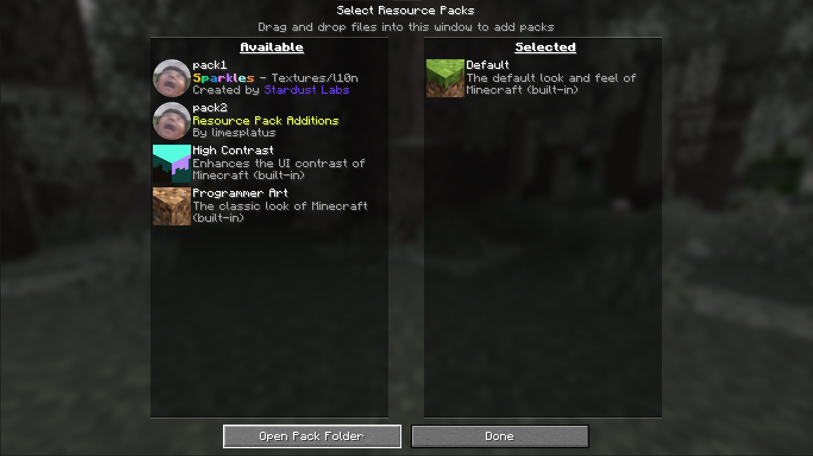
       
       The packs not show up as AVAILABLE

   * Switch the packs to SELECTED as in only the ones titles pack1 , pack2 ,etc. NOT Programmer Art or High Contrast

     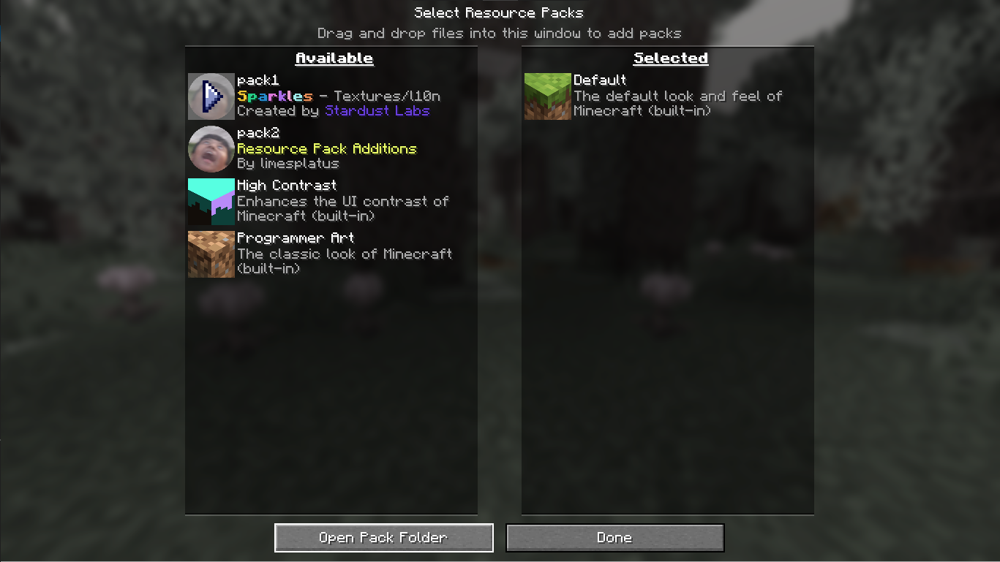    
       
       Hover over the packs in AVAILABLE and click on the arrow to move them to Selected do this for ALL THE DOWNLOADED PACKS like pack1 , pack2 , etc. As in ONLY THE ONES WITH GANESH'S FACE 
   
   * Successful switching of the packs from AVAILABLE to SELECTED should look like :

     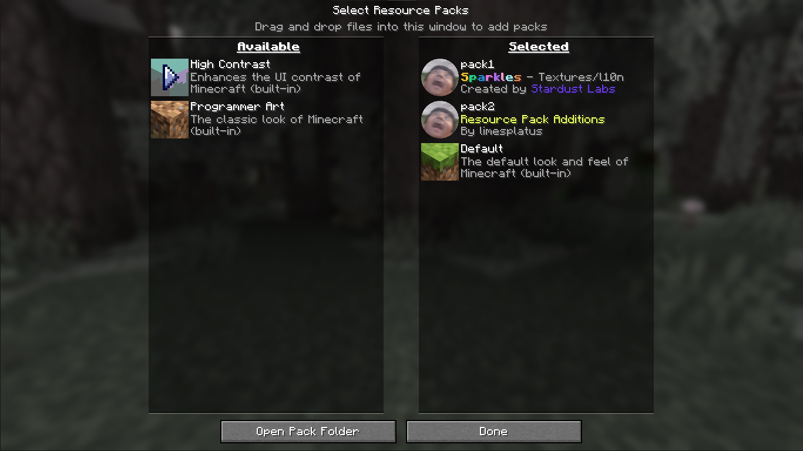


* NOW this is the LAST STEP do not SKIP IT, ENSURE you have exactly 2 custom packs + the Default pack in the SELECTED.Start counting and check for exactly two
PACKS WITH GANESH FACE ICON!!! ```two number src - ignore this box readers```

* You have not completed the installation and have unlocked the ability to legally affirm your success , TO affirm say "DING DING" out loud two times

## A guide on the LOGIN system

* When you initally log on to the server, you will be greeted with the lack of ability to move and a message in chat to "REGISTER"
s
     * Register with the command ```/register xxxxxxx``` REPLACE THE xxxxxxx with any password of your choosing that is ATLEAST SIX(6) Characters long

* MUG THIS PASSWORD PLEASE

* From next time onwards you will be asked to "LOGIN" login with ```/login xxxxxxx``` where the xxxxxxxx is the password you REGISTERED WITH.

### Password Resets

* Your Password CAN be reset, In case of a blunder move like Ding Liren's ROOK F2 CONTACT yours truly for a Password reset 

## List of all installed 'mods' and their respective Wikis

* Banner Bedsheets : https://modrinth.com/datapack/banner-bedsheets

* Banner Flags : https://modrinth.com/datapack/banner-flags

* Vanilla Refresh : https://modrinth.com/datapack/vanilla-refresh

* Incendium : https://stardustlabs.miraheze.org/wiki/Incendium

* Neo Enchants : https://github.com/Hardel-DW/NeoEnchant/wiki/Custom-Enchantments

* KawaMood's Racks : https://modrinth.com/datapack/racks

* KawaMood's Waystones : https://modrinth.com/datapack/waystones-data-pack

* SpellBound Weapons : https://github.com/SpluoSplatus/Spellbound-Weapons/wiki

* Terralith : https://stardustlabs.miraheze.org/wiki/Terralith

# Statistics :

* Time wasted : ``` 220 Hours : 56 Minutes : 19 Seconds ```
* Shanmugamakash Rajaravisankar (Stings) consumed for its sake : 96
* Time of writing : 1:57 AM 22/1/2025

 
